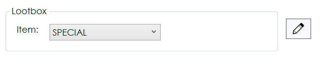

# JRPG Project Platform Designer
> Developed for the [JRPG-Project](https://github.com/ZenShouko/JRPG-Solution), this tool allows users to create their own stages.

## Feature list
- Creating a platform
- Assigning the player starting position
- Placing lootboxes and enemies
- Creating and modifying enemy parties
- Loading up and exporting platforms

*By placing the platform file inside the correct folder, the game will automatically read and render it!*

### A brief breakdown of how to use the the features
**Clicking on the pencil button [✏️] will activate the current action. Leftclicking on the preview grid will draw on it, rightclicking will remove.**

#### #Platform properties
*Allows to set the name and the amount of cells of a platform.*

When clicked on Apply, the app immediately renders a preview.

#### #Tiles
*Here you can pick a tile that you want to place on the grid.*

When clicked on the pencil button, the current action will be set on "drawing tiles". Now you can click on the cells in the preview and it will place the selected tile.
Clicking on fill will fill all the empty tiles with the selected tile.
To remove tiles, select the "Empty" tile in the options.

#### #Player
*Allows to assign the player position.*
Clicking on the pencil button will set the current action to "placing player". Now you can assign the starting position of the player.

#### #Lootbox
*Allows to place lootboxes on the platform.*
Pick a rarity of the lootbox and add it to the platform. Rightclicking will remove the selected lootbox.

#### #Foes
*Allows to place foeparties on the platform. In addition, create and modify parties.*
Select a foe party and place it on the platform. Clicking on [Create] or [Modify] will open a new window. [Delete] will delete the selected party.

#### #Foe party window
*The party creating window. Create or modify parties here. Additionaly, allows to edit stats and other attributes as well.*

**Current Line Up**  
[Add] will open a list with all the known foes that you can add to your line up.
[Remove] removes the selected foe.
[Throw to front] helps with arranging the line up and will throw the selected foe to the start of the line up.
Foes can be selected through the combobox or by clicking on them in the line up.

**Miscellaneous**  
Edit the name, level and movement behaviour. Always click on [Apply] or the changes won't take place.

**Stats**  
Displays the stats of the foe. When clicking on a stat, the corresponding textbox will be enabled to allow modifying the stat.

Recommended to give your party a meaningful name for easy distinction.

#### #Actions
*Load or export your platform.*

[Save] will export the platform.  
[Load] will load a platform.  
[Update] will update the platform. This button is only enabled when you loaded up a platform prior.  
[Reset] will restart the app.  
[Assign Default Directory] allows you to select a default directory. Now, every time you open FileDialog, it will open the default directory. If not set, it will open Documents by default.  

> In order for the game to load the custom platform, it must be saved to the **Stages** folder inside the project folder.
